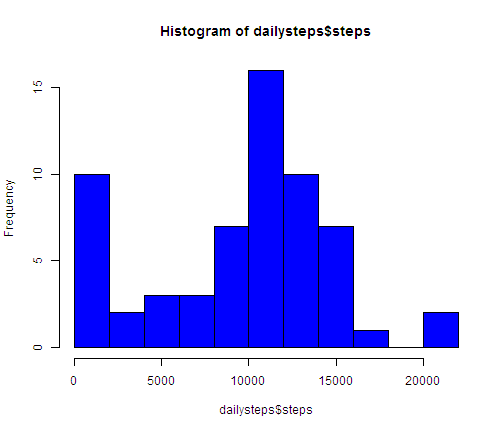
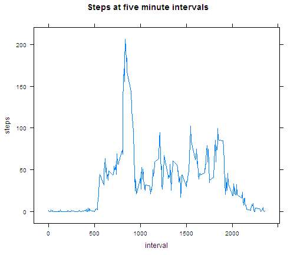
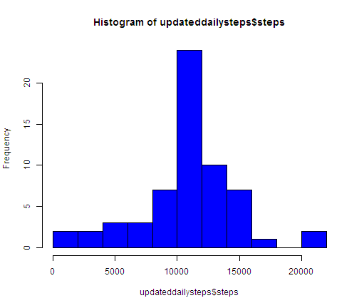
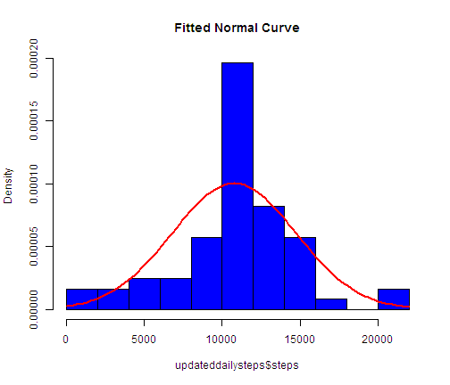
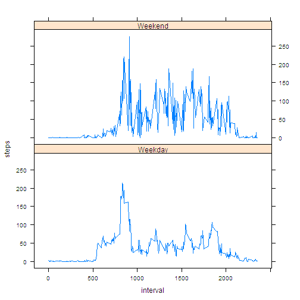

# Analysis of Activity Monitoring
========================================================

## Introduction

This analysis uses the data from a personal activity monitoring device collected at 5 minute intervals through out the day. The data consists of two months of data from an anonymous individual collected during the months of October and November, 2012 and include the number of steps taken in 5 minute intervals each day.

## Loading and preprocessing the data

This first piece of code reads the data set and creates the variables for use in later
parts of the analysis.   The new variables created at this stage are :
- x : the initial data frame
- Date :         conversion of input to date format
- dayofweek :    weekdays of the date field  
- weekday :  transformation of the dayofweek to weekday and weekend factors
- hourblock : transformation of time intervals into sections of day, 

The hourblock will be used for later calculations of missing value replacements


```r
library(lattice)
x <- read.csv("activity.csv")
x$Date <- as.Date(x$date)
x$dayofweek <- weekdays(x$Date)
x$weekday <- "Weekday"
x$weekday[x$dayofweek == c("Sunday", "Saturday")] <- "Weekend"
x$hourblock <- "Not Assigned"
x$hourblock[x$interval < 600] <- "Before Sunrise"
x$hourblock[x$interval >= 600 & x$interval < 1000] <- "Early Morning"
x$hourblock[x$interval >= 1000 & x$interval < 1200] <- "Mid Morning"
x$hourblock[x$interval >= 1200 & x$interval < 1400] <- "Lunch"
x$hourblock[x$interval >= 1400 & x$interval < 1700] <- "Afternoon"
x$hourblock[x$interval >= 1700 & x$interval < 1900] <- "Evening"
x$hourblock[x$interval >= 1900] <- "Night"
```


## Create Summary Frames for Later Analysis
The data frames created are
- dailysteps: total steps per day summed from the intervals
- fiveminute : average steps for each of the five minute intervals
- meansxhourblock : calculated means by the hourblock variable created in the last step
- updated : merging back in the meansxhourblock with the original data frame, x


```r

dailysteps <- aggregate(x$steps, by = list(x$Date), FUN = sum, na.rm = TRUE)
dailysteps$steps <- dailysteps$x

fiveminute <- aggregate(x$steps, by = list(x$interval), FUN = mean, na.rm = TRUE)
fiveminute$steps <- fiveminute$x
fiveminute$interval <- fiveminute$Group.1

meansxhourblock <- aggregate(x$steps, by = list(x$hourblock), FUN = mean, na.rm = TRUE)
meansxhourblock$hourblockmean <- meansxhourblock$x

```

## Histogram of Total Steps Per Day


```r
dailysummary <- summary(dailysteps$steps)
dailymedian <- dailysummary[4]
dailymean <- dailysummary[5]
hist(dailysteps$steps, breaks = 10, col = "blue")
```

 

The median is 9350 and the mean is 1.28 &times; 10<sup>4</sup>

## Average Daily Activity Pattern

```r
xyplot(steps ~ interval, data = fiveminute, type = "l", main = "Steps at five minute intervals")
```

 

```r
maximumrecords = subset(fiveminute[fiveminute$steps == max(fiveminute$steps), 
    ])
maximuminterval = maximumrecords[1, 1]
```

The maximum step value 206.1698 this occurs at the time interval 835

## Imputation of Missing Values

The method employed here makes use of the summaries by time block period created in the first stage.  These produce a reasonably comprehensive set of means which hopefully reflect the different intensities of exercise at different times of the day. 


```r
missing <- sum(is.na(x$steps))
```

total missing values in data frame = 2304
We can now replace the missing values with the hour block means as calculated.
This involves creating a new data frame (updated) where the block means are merged in
and the NAs are replaced

```r
updated <- merge(x, meansxhourblock, by.x = "hourblock", by.y = "Group.1")
updated$newsteps <- updated$steps
ind <- which(is.na(updated$newsteps), arr.ind = TRUE)
updated$newsteps[ind] <- updated$hourblockmean[ind]
```

Finally, we can re-summarise and look at the frequency distribution again
This new frequency distribution looks much more normal/gaussian and removes the 
high frequency incidence of zeros in the original data which lowered the mean and median.

```r
updateddailysteps <- aggregate(updated$newsteps, by = list(updated$Date), FUN = sum, 
    na.rm = TRUE)
updateddailysteps$steps <- updateddailysteps$x
summary(updateddailysteps$steps)
```

```
##    Min. 1st Qu.  Median    Mean 3rd Qu.    Max. 
##      41    9820   10800   10800   12800   21200
```

This is the updated histogram

```r
hist(updateddailysteps$steps, breaks = 10, col = "blue")
```

 

This is the histogram  with a normal curve fitted to the updated data set

```r
hist(updateddailysteps$steps, breaks = 10, freq = FALSE, col = "blue", main = "Fitted Normal Curve")
curve(dnorm(x, mean = mean(updateddailysteps$steps), sd = sd(updateddailysteps$steps)), 
    add = TRUE, col = "red", lwd = 2)
```

 


## Comparison of Weekend and Weekdays
This uses the calculated weekday/weekend factor created from the initial dataframe

```r
weekdaysummary <- aggregate(x$steps, by = list(x$interval, x$weekday), FUN = mean, 
    na.rm = TRUE)
weekdaysummary$category <- weekdaysummary$Group.2
weekdaysummary$steps <- weekdaysummary$x
weekdaysummary$interval <- weekdaysummary$Group.1
```

and then uses lattice to produce the chart

```r
xyplot(steps ~ interval | category, data = weekdaysummary, type = "l", layout = c(1, 
    2))
```

 


